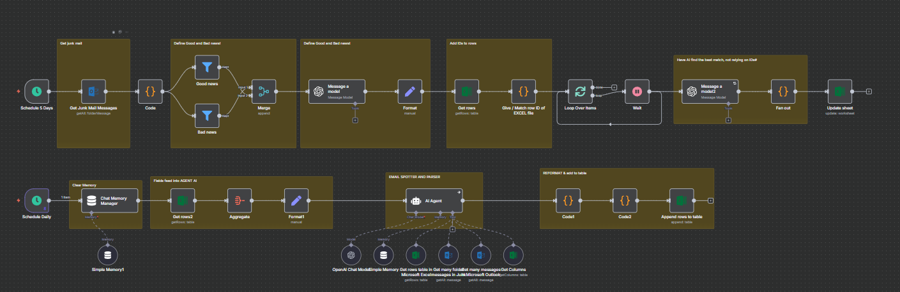
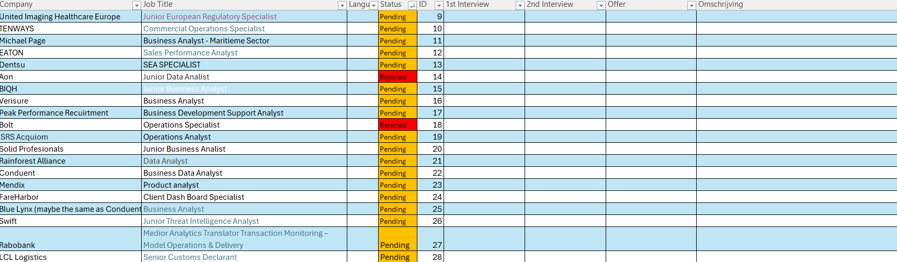

# Job Application Tracker — n8n + AI (Personal Learning Repo)

> **This is a highly customized, personal learning project.** It automates parts of *my* job application process using n8n and AI agents. It probably won’t be plug‑and‑play for anyone else — and that’s okay: this repo mainly documents what I tried, what worked, and what I learned.

---

## What’s inside

- `workflow/job-application-tracker.n8n.json` — the n8n workflow export you can import.
- `assets/job-application-tracker-workflow.png` — full visual of the workflow graph (high level).
- `assets/excel-applications.png` — a snapshot of the Excel tracking table the flow updates.

### Workflow at a glance

### Excel table the flow updates

---

## How it works (very briefly)

- **Email intake (Outlook):** Pulls emails from *Junk* and looks for good/bad signals.
- **Parsing with AI:** Uses OpenAI chat models to extract `{ jobTitle, company, status }` from message subject/body.
- **Excel sync (Microsoft 365):** Matches to an existing row (using fuzzy match via AI), then updates the row’s `Status` or appends a new one when it’s a fresh confirmation.
- **Rate limiting:** Processes results in small batches with waits to be gentle on APIs.
- **Memory:** Simple conversational memory nodes were used during development to coordinate tool calls.

The exact node configuration, prompts, and Excel workbook IDs are all tailored to my environment.

---

## Importing the workflow (n8n)

1. Open n8n → **Workflows** → **Import from File**.
2. Choose `workflow/job-application-tracker.n8n.json`.
3. Update these to match your own setup:
   - Outlook connections and folder IDs (Inbox/Junk).
   - Excel Workbook / Worksheet / Table IDs.
   - OpenAI (or compatible) credentials and model names.
4. Test with a **single email** first and watch the Execution view.

> Note: If you don’t use the same Excel schema, update the *Set* nodes and the *Update/Append* mappings accordingly.

---

## Why this repo exists

I’m using AI agents to **augment** a real process (job applications) and I want a written, reproducible record of what I tried. The point is learning, not shipping a generic product.

---

## Files & structure

```
.
├── assets/
│   ├── job-application-tracker-workflow.png
│   └── excel-applications.png
├── workflow/
│   └── job-application-tracker.n8n.json
└── README.md
```

---

## Safety & secrets

- The export includes **resource IDs** from my environment. Replace these with yours.
- Keep API keys in n8n credentials, not hard‑coded in nodes / code.
- Be mindful of PII in emails — mask what you store if needed.

---

## Ideas to iterate later

- Swap to queue-based processing for higher volume.
- Add a “human-in-the-loop” review step before Excel writes.
- Log decisions (and AI outputs) to a separate sheet for auditing.
- Export analytics to a dashboard (e.g., Supabase + Metabase).

---

© 2025 — Personal learning project.
